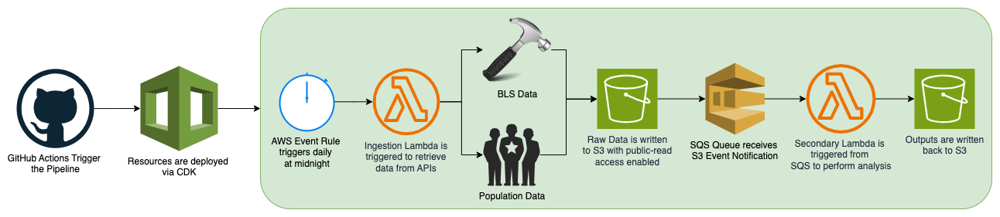

# Rearc Data Quest Submission: Sean Owens

### Part 1

The BLS data is available on S3 at the following links:
- [pr.class](https://790890014576-rearc-data-quest-bucket.s3.amazonaws.com/data/bls/pr.class)
- [pr.contacts](https://790890014576-rearc-data-quest-bucket.s3.amazonaws.com/data/bls/pr.contacts)
- [pr.data.0.Current](https://790890014576-rearc-data-quest-bucket.s3.amazonaws.com/data/bls/pr.data.0.Current)
- [pr.data.1.AllData](https://790890014576-rearc-data-quest-bucket.s3.amazonaws.com/data/bls/pr.data.1.AllData)
- [pr.duration](https://790890014576-rearc-data-quest-bucket.s3.amazonaws.com/data/bls/pr.duration)
- [pr.footnote](https://790890014576-rearc-data-quest-bucket.s3.amazonaws.com/data/bls/pr.footnote)
- [pr.measure](https://790890014576-rearc-data-quest-bucket.s3.amazonaws.com/data/bls/pr.measure)
- [pr.period](https://790890014576-rearc-data-quest-bucket.s3.amazonaws.com/data/bls/pr.period)
- [pr.seasonal](https://790890014576-rearc-data-quest-bucket.s3.amazonaws.com/data/bls/pr.seasonal)
- [pr.sector](https://790890014576-rearc-data-quest-bucket.s3.amazonaws.com/data/bls/pr.sector)
- [pr.series](https://790890014576-rearc-data-quest-bucket.s3.amazonaws.com/data/bls/pr.series)
- [pr.txt](https://790890014576-rearc-data-quest-bucket.s3.amazonaws.com/data/bls/pr.txt)

### Part 2

Source code for data ingestion can be found in the [ingestion.py](infra/lambda/ingestion/ingestion.py) Lambda function. As requested, no filenames are hardcoded, instead, we scrape the HTML for HREFs which don't end in `/` (we don't want directories), and then iterate through the list of filenames to retrieve and write the data to S3.

### Part 3

The source code for the data processing lives in two places, [processing.py](infra/lambda/processing/processing.py) and [productivity_population_analysis.ipynb](notebooks/productivity_population_analysis.ipynb).

The former is the automated Lambda which listens for an SQS message to trigger processing. The SQS queue itself receives S3 Event Notifications whenever a file with the regex `data/population/*.json` is uploaded to the bucket. In the first Lambda, this is the final file to be written to S3.

The latter file is the requested Jupyter Notebook which walks through the data munging in greater detail with explanations of the cleanup performed on the data, why the cleanup was necessary, and what queries or aggregations were done to arrive at the outputs.

### Part 4

Source code for the data pipeline infrastructure can be found within the `infra` folder, specifically within [rearc_quest_stack.py](infra/stacks/rearc_quest_stack.py). One other file worth checking out is the GitHub Action Workflow file, [cicd-workflow.yaml](.github/workflows/cicd-workflow.yaml), which is responsible for triggering the CDK Diff on a PR and Deploy when a PR is merged into `main`.

## Areas for Future Development

- Using OIDC instead of AWS Keys to manage the GitHub Deployment. While OIDC is definitely the preferred route, in the interest of time and due to some esoteric and uninformative bugs, keys were the quickest way to get the MVP up and working.
- Establishing Monitoring on the pipeline. Setting up alerting through CloudWatch to trigger PagerDuty or SES notifications whenever the pipeline encounters failures would be a great way to enhance the robustness of the pipeline.
